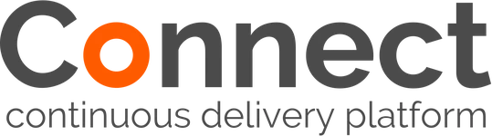

= Connect - Continuous delivery platform
by link:https://clearpoint.co.nz[ClearPoint]
:toc: left
== Introduction
Connect is and enterprise level continuous delivery platform built with open source technologies and best practice approaches to building modern software with containerisation via docker, orchestration by Kubernetes and extracted infrastructure provider layer.  Currently only supported on AWS.

== Getting started/Installation

Details here on how to boostrap the connect platform.

=== Bootstrapping on AWS

=== Developer setup on MiniKube
link:https://github.com/kubernetes/minikube[Minikube] is our recommended approach to running your cluster on development machines.

== Kubernetes
Todo some stuff here in building clusters on AWS

=== Building clusters on AWS

== The Pipeline and Tools

All you need to create a CD Pipeline running inside it's own Kubernetes cluster.

=== Jenkins

=== Nexus

=== Docker registry

=== The Connect Dashboard

== Infrastructure as Code
Best practice on how to build your infrastructure as code

== Sample applications and shared libraries

=== Java

==== Sample Apps

==== Shared Libraries

=== NodeJS

==== Sample Apps

==== Shared Libraries

=== .Net Core

==== Sample Apps

==== Shared Libraries

== Acceptance Tests

=== Guide to automated acceptance testing

== Support

For enterprise support please contact link:http://clearpoint.co.nz[ClearPoint] or email connect@clearpoint.co.nz

== License

Copyright 2017 ClearPoint Ltd. - New Zealand

Licensed under the Apache License, Version 2.0 (the "License");
you may not use this file except in compliance with the License.
You may obtain a copy of the License at

    http://www.apache.org/licenses/LICENSE-2.0

Unless required by applicable law or agreed to in writing, software
distributed under the License is distributed on an "AS IS" BASIS,
WITHOUT WARRANTIES OR CONDITIONS OF ANY KIND, either express or implied.
See the License for the specific language governing permissions and
limitations under the License.

include::includes/footer.adoc[]
