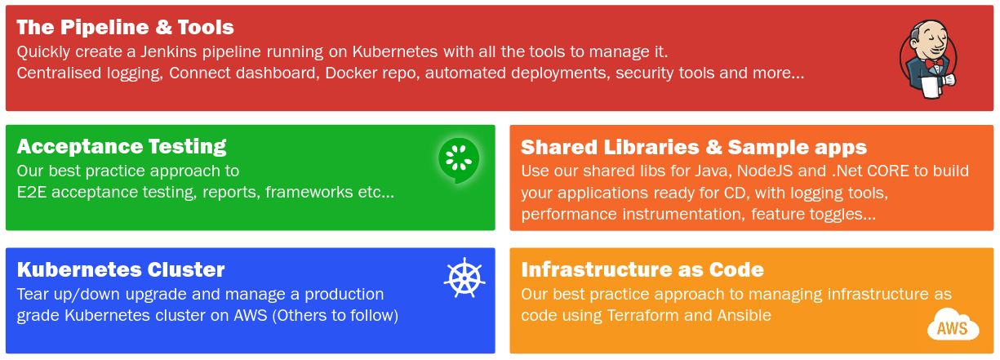

image::images/connect-logo.png[]
by link:https://clearpoint.co.nz[ClearPoint]

= Connect - Continuous Delivery Platform
Author <connect@clearpoint.co.nz>
v1.0, 2017-07-07
:toc: left
:imagesdir: images
:homepage: http://connect.cd

== Introduction
Welcome to Connect - Continuous Delivery Platform.

Connect is a collection of open source projects put together to help share best practice approaches to Continuous Delivery (CD) using containerisation (via Docker), orchestrated by Kubernetes.

The libraries are designed to be used either standalone or together and are grouped into the following areas:

include::includes/installation.adoc[]

include::includes/kubernetes.adoc[]

include::includes/pipeline.adoc[]

include::includes/infrastructure.adoc[]

include::includes/samples.adoc[]

include::includes/testing.adoc[]

include::includes/support.adoc[]

include::includes/license.adoc[]
